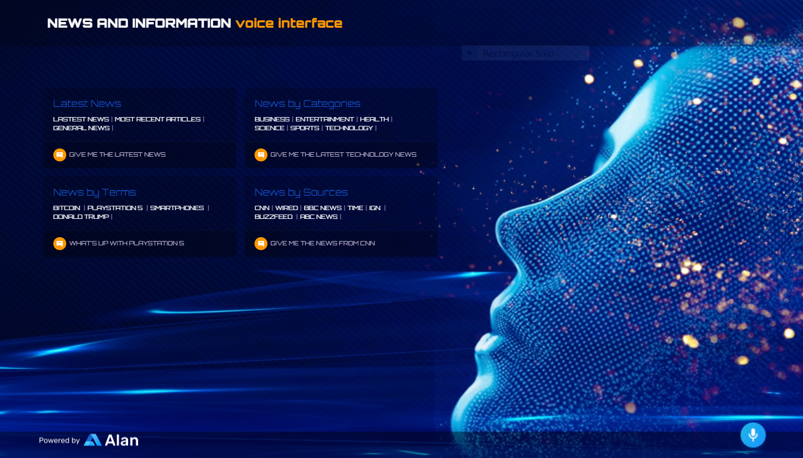

# Alan AI News Reader



> News Reader Application built in React and integrated with the Alan Conversational Voice AI Platform.

---

### Table of Contents

- [Description](#description)
- [How To Use](#how-to-use)
- [Sources](#sources)
- [License](#license)

---

## Description

This application integrates a React Application with the Alan Conversational Voice AI Platform to allow a user to hear the news from various outlets/sources based on voice input from the user.

#### Technologies

- React: v16.13.1
- Alan-AI: v1.3.0
- Materialize-CSS: v1.0.0-rc.2

---

## How To Use

#### 1. Install Dependencies and Run

```
#npm install
#npm start
```

#### 2. Alan AI Integration: https://alan.app/docs/

---

## Sources

This application is adapted from the Artificial Intelligence React Application Tutorial
by [ JavaScript Mastery](https://www.youtube.com/c/JavaScriptMastery/search?query=alan%20aiAlan)

---

## License

This project is licensed under the [MIT License](#LICENSE.txt)

Copyright (c) 2021 [Amelia Hill](#https://ameliahill.com)
